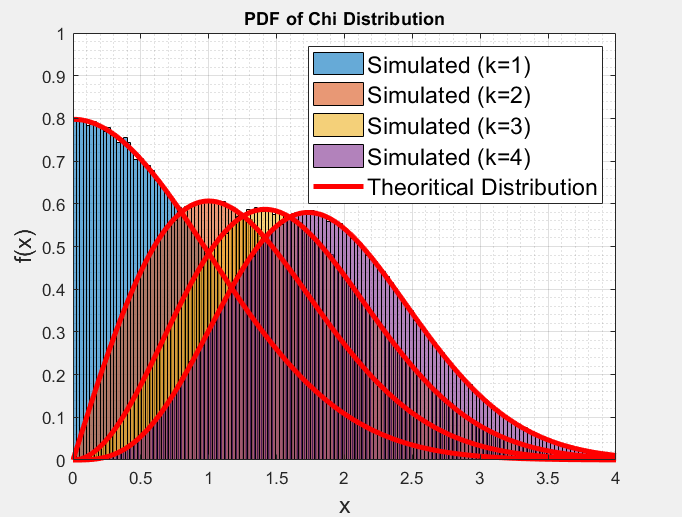
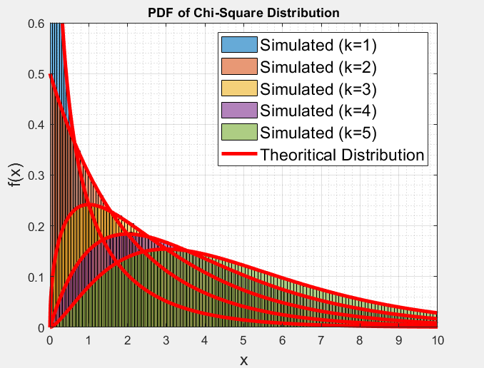
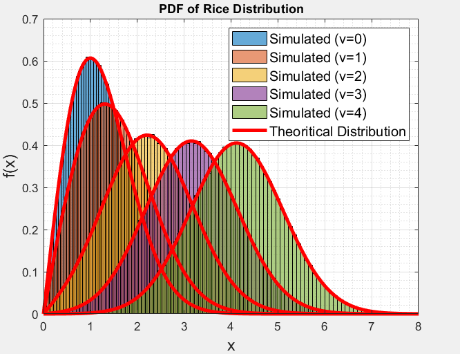
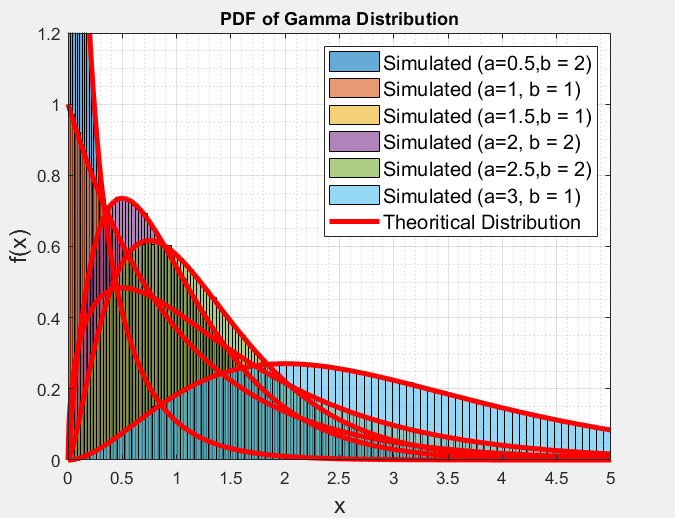
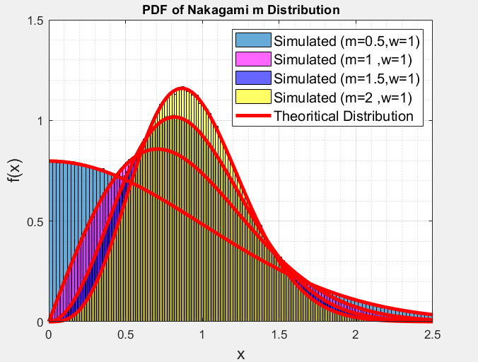

# 6-RV_Distributions-Probability
Ploting 6-different random varaible distributions from normal/gaussian random distribution.

https://in.mathworks.com/matlabcentral/fileexchange/authors/my_fileexchange

